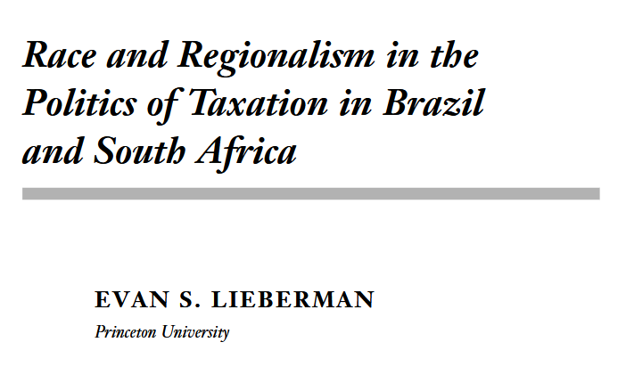
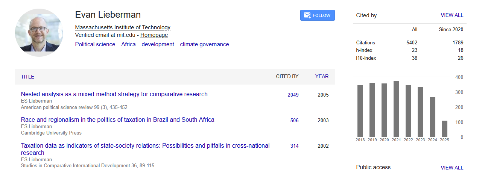

class: center, middle

```{css, echo=FALSE}
pre {
  max-height: 400px;
  overflow-y: auto;
}

pre[class] {
  max-height: 200px;
}
```

```{r, load_refs, include=FALSE, cache=FALSE}
# Initializes the bibliography
library(RefManageR)

library(ggplot2)
library(dplyr)
library(readr)
library(nlme)
library(jtools)
library(hrbrthemes)
library(mice)
library(knitr)

BibOptions(check.entries = FALSE,
           bib.style = "authoryear", # Bibliography style
           max.names = 3, # Max author names displayed in bibliography
           sorting = "nyt", #Name, year, title sorting
           cite.style = "authoryear", # citation style
           style = "markdown",
           hyperlink = FALSE,
           dashed = FALSE)
#myBib <- ReadBib("assets/myBib.bib", check = FALSE)
# Note: don't forget to clear the knitr cache to account for changes in the
# bibliography.
```
```{r xaringan-themer, include=FALSE, warning=FALSE}
library(xaringanthemer,MnSymbol)
style_mono_accent(
  base_color = "#1c5253",
  header_font_google = google_font("Josefin Sans"),
  text_font_google   = google_font("Montserrat", "300", "300i"),
  code_font_google   = google_font("Fira Mono"),
  text_font_size = "1.6rem"
)
```

---


---
### Freedom and Guidance

---
### Lieberman's Paradigm

```{r, echo = FALSE, out.width="70%", fig.retina = 1, fig.align='center'}

```

---
### Lieberman Example


---
### Lieberman Example


---
### Lieberman Example


---
### Lieberman Example



---
### Lieberman Example


---
### Lieberman Example


---
### Lieberman Example


---
### Lieberman Example


---
### Lieberman Example


---

*Triangulation* is the combination of research designs drawn from more
than one methodological family both or all of which are aimed at
providing separate answers to a research question.

---

*Integrative multi-method research* is research that uses techniques
drawn from more than one methodological family in the course of
answering a single integrated research question or testing a single
overarching hypothesis.


---
### Costs of Triangulation


---
### Costs of Triangulation


---
### A Major Interdiciplinary View


---
### A Major Interdiciplinary View


---
### A Recent Political Science View


---
### A Recent Political Science View


---
### A Spectrum of Arguments about Multiple Methods

-   Social-science methods never teach us anything

-   One family of research is always better than the others

-   Quantitative and qualitative research can never communicate

-   Triangulation

-   Integration

---
### Goertz and Mahoney

Qualitative and quantitative research speak different languages because
of differences in ontology.

---
### Beech and Kaas


---
### Beech and Kaas


---
### Concepts of Causation

Potential Outcomes Framework

$T_{i}$, $Y_{i,t}$


---
### Four Traditions of Causal Thought

1. Humean Regularity Theory

2. Counterfactual Theory

3. Manipulation Theory

4. Capacities and Mechanisms


---
### Concepts of Causation

Necessary Causation

$Y_{i,0} = 0$ for all $i$.


---
### Concepts of Causation

Sufficient Causation

$Y_{i,1} = 1$ for all $i$.


---
### Concepts of Causation

Causal Pathways

$T_{i}$

$M_{i,t,1}$, $M_{i,t,m1,2}$, $M_{i,t,m1,m2,3}$, etc

$Y_{i,t,m1,m2,m3}$


---
### Group Exercise

At [this website](https://jnseawright.github.io/practice-of-multimethod/Chapter-1.html), find a small group and work on the Multi-Method Elements in Snow on Cholera exercise.

---
### Florida, 2000

-   Brady (2004)


---
### Florida, 2000

-   John Lott (2000) uses regression to estimate that early media calls
    in the Florida panhandle cost George W. Bush at least 10,000 votes.


---
### Florida, 2000

$303,000 * \frac{1}{72} \approx 4,200$

-   Census data from 1996 suggest that about 1/12 of voters go to the
    polls during the last hour.

-   The call was made with 10 minutes to go, so perhaps 1/72 of voters
    who would have voted had not yet arrived at the polls.


---
### Florida, 2000

$303,000 * \frac{1}{72} * \frac{1}{5} \approx 840$

-   Research on media exposure suggests that 20% or fewer of people in
    the panhandle would have heard the media call during the 10 minutes
    before the polls closed.


---
### Florida, 2000

$303,000 * \frac{1}{72} * \frac{1}{5} * \frac{2}{3} \approx 560$

-   Bush was supported by about 2/3 of panhandle voters.


---
### Florida, 2000

$303,000 * \frac{1}{72} * \frac{1}{5} * \frac{2}{3} * \frac{1}{10} \approx 56$

-   Prior quantitative research suggests that about 10% of intended
    voters who hear an early call before they arrive at the polls may be
    dissuaded from voting.


---
### Rights and Liberties

-   Survey research on tolerance, civil liberties, individual rights

-   In-depth analysis of 30 think-aloud transcripts from a survey
    pretest


---
### Rights and Liberties

-   Do citizens anchor their opinions to what they understand of current
    law?


---
### Rights and Liberties

Q. Do you think that a person who is caught red-handed deserves a full
blown trial?

A. Yeah, I think that's one of our rights. I think that's in the Bill of
Rights that, uhh, you have the right to a trial. Uhh how, what defense
the attorney would take I don't know. I mean it --- but again it's a
matter of making the punishment fit the crime which I think a trial,
that's one purpose of a trial. I mean I don't think a man that's
stealing a loaf of bread should be executed. And I think a trial would
bring out, uh, how serious the crime was and maybe there were some
mitigating circumstances. And I think all that's part of a trial. So I
think anyone deserves a trial.


---
### Rights and Liberties

Q. What if the police stop someone for weaving dangerously in traffic.
Do they have the right to search the glove compartment or trunk of the
car if they suspect that he's on drugs?

A. I think the courts have said that they haven't, isn't that what they
courts have said? Well, you hear verdicts where it's on and off but it,
it seems to me that they, they probably shouldn't.

