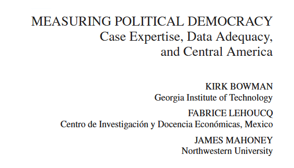

class: center, middle

```{css, echo=FALSE}
pre {
  max-height: 400px;
  overflow-y: auto;
}

pre[class] {
  max-height: 200px;
}
```

```{r, load_refs, include=FALSE, cache=FALSE}
# Initializes the bibliography
library(RefManageR)

library(knitr)
library(ggplot2)
library(dplyr)
library(readr)
library(nlme)
library(jtools)
library(hrbrthemes)
library(mice)

BibOptions(check.entries = FALSE,
           bib.style = "authoryear", # Bibliography style
           max.names = 3, # Max author names displayed in bibliography
           sorting = "nyt", #Name, year, title sorting
           cite.style = "authoryear", # citation style
           style = "markdown",
           hyperlink = FALSE,
           dashed = FALSE)
#myBib <- ReadBib("assets/myBib.bib", check = FALSE)
# Note: don't forget to clear the knitr cache to account for changes in the
# bibliography.
```
```{r xaringan-themer, include=FALSE, warning=FALSE}
library(xaringanthemer,MnSymbol)
style_mono_accent(
  base_color = "#1c5253",
  header_font_google = google_font("Josefin Sans"),
  text_font_google   = google_font("Montserrat", "300", "300i"),
  code_font_google   = google_font("Fira Mono"),
  text_font_size = "1.6rem"
)
```

---
### Case Study Roles

-   Test Measurement

-   Test Causal Pathway Hypotheses

-   Account for Outliers

-   Test for Confounders

-   Test for Complexity


---
### Measurement



---
### Measurement


---
### Measurement


---
### Measurement


---
### Measurement


---
### Measurement


---
### Measurement

Chong


---
### Measurement

1.  Use in-depth exploration of one or a few cases for qualitative
    correspondence test.

2.  Process trace the quantitative measurement process to form a theory
    for the causes of any errors.

3.  Qualitatively examine a few other cases that would be likely to
    suffer from the same kinds of errors to test the theory.

4.  Revise the coding for all relevant cases.


---
### Mechanisms?

1.  Causal pathway

2.  Unobservable cause

3.  Easily observable cause

4.  Bounded explanation

5.  Universal explanation


---
### Mechanisms?

6.  Highly contingent explanation

7.  Explanation built on lawlike regularities

8.  An analytic technique

9.  A micro-level explanation of a macro-level phenomenon


---
### Process Tracing


---
### Causal Pathways and Overall Causal Effects

-   Is the causal pathway "isolated" from other causal factors?

-   Is the causal pathway "exhaustive"?

-   Could the causal pathway plausibly account for the whole estimated
    effect?


---


---


---


---


---


---
### Do We Have to Explain Outliers?


---
### Is Salt Bad for You?

---
### Exploring Outliers

```{r, echo = FALSE, out.width="70%", fig.retina = 1, fig.align='center'}
library(knitr)

```

---
### Omitted Variables

Omitted Variables vs Confounders


---
### Confounders

1.  Trace the causes of the cause, then forward to $Y$: triangular
    process-tracing design.

2.  Examine the $X$ to $Y$ causal pathway for any influence by potential
    causes of the cause.


---
### Causal Complexity

-   Interaction terms

-   Substitutability

-   Spillover

---
### Diffusion

Statistical models


---
### Diffusion

Can process tracing help?


---
### Diffusion

Elkins and the Brazilian constitutional assembly.


---
### Regression Roles

-   Testing generalizability

-   Causal pathways and models

-   Addressing measurement problems

-   Testing the "importance" of omitted variables


---
### Generalizability

Data Quality

Does the model capture the qualitative hypothesis?


---
### Generalizability

Data Quality for Historical Data Sets:

-   Proximity of Observations

-   Transparency of Citations

-   Certainty of the Historical Record

-   Attention to Valid Comparison


---
### Generalizability

Data Quality for Surveys:

-   Simple Questions

-   Framing Effects

-   Pre-Test Evidence


---
### Generalizability

"Thick" Concepts:

-   Cannot be reduced to a single indicator without losing some
    important part of their meaning.

-   Multidimensional: no aspect of the concept is reducible to any of
    the others.


---
### Mediation

$T_{i}$ is 1 or 0

$Y_{i}(t)$


---
### Mediation

$M_{i}(t)$

$Y_{i}(t, m)$


---
### Mediation

$\tau_{i} = Y_{i}(1, M_{i}(1)) - Y_{i}(0, M_{i}(0))$

$\delta_{i}(t) = Y_{i}(t, M_{i}(1)) - Y_{i}(t, M_{i}(0))$

$\zeta_{i}(t) = Y_{i}(1, M_{i}(t)) - Y_{i}(0, M_{i}(t))$


---
### Mediation

Assumption of Sequential Ignorability:

$\{Y_{i}(t,m), M_{i}(t^{'})\} \perp T_{i} | X_{i} = x$

and

$Y_{i}(t,m) \perp M_{i} | T_{i} = t^{'}, X_{i} = x$


---
### Mediation

1.  Fit model for mediator, conditional on treatment, etc.

2.  Fit model for observed outcome, conditional on treatment, mediator,
    etc.

3.  Using the first model, simulate $M_{i}(0)$ and $M_{i}(1)$ for each
    case.


---
### Mediation

4.  Using the second model, simulate $Y_{i}(0, M_{i}(0))$,
    $Y_{i}(0, M_{i}(1))$, $Y_{i}(1, M_{i}(0))$, and $Y_{i}(1, M_{i}(1))$
    for each case.

5.  Use simulated values to compute $\tau_{i}$, $\delta_{i}(t)$, and
    $\zeta_{i}(t)$ for each case.

6.  Repeat steps 3, 4, and 5 many times, saving the calculated values
    for each repetition.


---
### Multi-Method Tests of Mediation Models

-   Case Selection

-   Qualitative Design Considerations


---
### Hands-On

At [this website](https://jnseawright.github.io/practice-of-multimethod/Chapter-5.html), work through the exercises labeled *A simple regression example* and *Integrative case-study followup*.