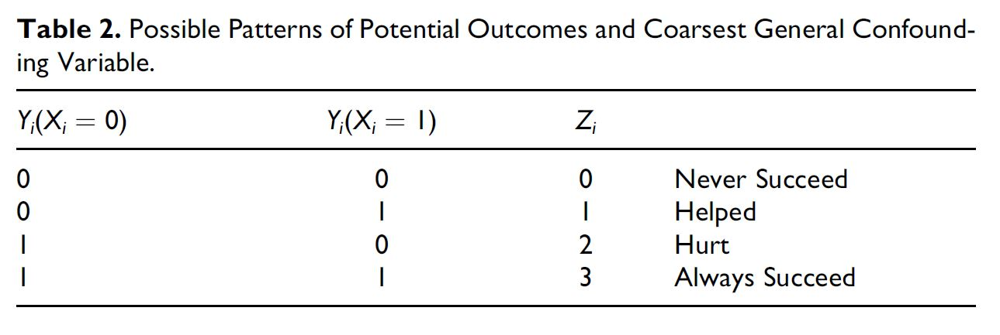

class: center, middle

```{css, echo=FALSE}
pre {
  max-height: 400px;
  overflow-y: auto;
}

pre[class] {
  max-height: 200px;
}
```

```{r, load_refs, include=FALSE, cache=FALSE}
# Initializes the bibliography
library(RefManageR)

library(knitr)
library(ggplot2)
library(dplyr)
library(readr)
library(nlme)
library(jtools)
library(hrbrthemes)
library(mice)

BibOptions(check.entries = FALSE,
           bib.style = "authoryear", # Bibliography style
           max.names = 3, # Max author names displayed in bibliography
           sorting = "nyt", #Name, year, title sorting
           cite.style = "authoryear", # citation style
           style = "markdown",
           hyperlink = FALSE,
           dashed = FALSE)
#myBib <- ReadBib("assets/myBib.bib", check = FALSE)
# Note: don't forget to clear the knitr cache to account for changes in the
# bibliography.
```
```{r xaringan-themer, include=FALSE, warning=FALSE}
library(xaringanthemer,MnSymbol)
style_mono_accent(
  base_color = "#1c5253",
  header_font_google = google_font("Josefin Sans"),
  text_font_google   = google_font("Montserrat", "300", "300i"),
  code_font_google   = google_font("Fira Mono"),
  text_font_size = "1.6rem"
)
```

---
### Discovery vs. Confirmation


---
### Case Selection

1.  Study the entire population.

2.  Take a random sample.

3.  Follow some rule for deliberate case selection.


---
### Choosing Cases

-   Case-selection rules:

    -   Random sampling

    -   Typical cases

    -   Diverse cases

    -   Extreme cases

    -   Deviant cases

    -   Influential cases

    -   Most-similar cases

    -   Contrast cases


---
### Typical Cases

$$\text{Typicality}_{i} = - \text{abs} [y_{i} - \text{E}(y_{i} | x_{1,i}, x_{2,i}, \ldots, x_{k,i})]$$


---
### Extreme Cases

$$\text{Extremity}_{i} = \displaystyle| \frac{x_{i} - \bar{x}}{s} \displaystyle|$$


---
### Deviant Cases

$$\text{Deviantness}_{i} = - \text{Typicality}_{i}$$


---
### Influential Cases

-   Cook's distance is a statistical measure of how much the overall
    regression result would change if a given case is deleted.

-   A Cook's distance score of 1 or more usually is regarded as
    representing substantial influence.


---
### Influential Cases


---
### Most-Similar Cases

-   Matching techniques are an automated way of finding most similar
    cases.


---
### Contrast Cases


---
### Measurement Error in $Y$

$Y^{*}_{i} = Y_{i} + \delta_{Y, i}$

Random Sampling


---
### Measurement Error in $Y$

Typical/Deviant Cases:

$e_{i} = Y_{i} - \mathbb{H}_{i, \cdot}  Y + \delta_{Y, i}$


---
### Measurement Error in $Y$

Influential Cases


---
### Measurement Error in $Y$

Extreme Cases:

$Y^{*}_{i} = Y_{i} + \delta_{Y, i}$


---
### Measurement Error in $Y$

Most-Similar Cases

Contrast Cases


---
### Measurement Error in $X$

$X^{*}_{i} = X_{i} + \delta_{X, i}$

Random Sampling


---
### Measurement Error in $X$

Typical/Deviant Cases:

$e_{i} = Y_{i} - X_{i} \hat{\beta}^{*} - \delta_{X, i} \hat{\beta}^{*}$


---
### Measurement Error in $X$

Influential Cases


---
### Measurement Error in $X$

Extreme Cases:

$X^{*}_{i} = X_{i} + \delta_{X, i}$


---
### Measurement Error in $X$

Most-Similar Cases

Contrast Cases


---
### Confounding Variables

$e_{i} = d_{i} + \gamma \tilde{Z_{i}}$, where
$\tilde{Z_{i}} = Z_{I} - \text{E} (Z_{i} | X_{i})$

Random Sampling


---
### Confounding Variables

Typical/Deviant Cases:

$e_{i} = d_{i} + \gamma \tilde{Z_{i}}$


---
### Confounding Variables

Influential Cases


---
### Confounding Variables

Extreme Cases:

For confounders, extreme on $X$ may be a good strategy.

Extreme on $Y$ maximizes:

$\hat{Y}_{i} + d_{i} + \gamma \tilde{Z_{i}}$


---
### Confounding Variables

Most-Similar Cases

Contrast Cases


---
### Pathway Variables

$W_{i} = \nu + \mu X_{i} + \omega_{i}$

$Y_{i} = \alpha + \tau W_{i} + \sigma_{i}$

Random Sampling


---
### Pathway Variables

Typical/Deviant Cases:

$e_{i} = \tau \omega_{i} + \sigma_{i}$


---
### Pathway Variables

Influential Cases


---
### Pathway Variables

Extreme Cases:

$W_{i} = \nu + \mu X_{i} + \omega_{i}$

Extreme on $Y$ maximizes:

$Y_{i} = \alpha + \tau W_{i} + \sigma_{i}$


---
### Pathway Variables

Most-Similar Cases

Contrast Cases


---
### Summary: Analytic Arguments

|               | Deviant | Influential | Ext. $X$ | Ext. $Y$ |
| ------------- |:-------:| :----------:| :-------:| :-------:|
| Error in $Y$  | Good    | Mixed       | Poor     | Good     |
| Error in $X$  | Mixed   | Mixed       | Good     | Poor     |
| Confounders   | Mixed   | Mixed       | Good     | Good     |
| Pathway       | Good    | Mixed       | Good     | Mixed    |


---
### Propensity-Adjusted Extreme Cases


---


---


---


---


---
### Confirmation

<http://www.dagitty.net/dags.html>


---
### Herron and Quinn's Case Selection




---


---
### Hands-On

At [this website](https://jnseawright.github.io/practice-of-multimethod/Chapter-5.html), work through the exercise labeled *Case-selection Detective Work* vis-a-vis the choice of Yemen and Zimbabwe from the regression in the first exercise.
