class: center, middle

```{css, echo=FALSE}
pre {
  max-height: 400px;
  overflow-y: auto;
}

pre[class] {
  max-height: 200px;
}
```

```{r, load_refs, include=FALSE, cache=FALSE}
# Initializes the bibliography
library(RefManageR)

library(knitr)
library(ggplot2)
library(dplyr)
library(readr)
library(nlme)
library(jtools)
library(hrbrthemes)
library(mice)

BibOptions(check.entries = FALSE,
           bib.style = "authoryear", # Bibliography style
           max.names = 3, # Max author names displayed in bibliography
           sorting = "nyt", #Name, year, title sorting
           cite.style = "authoryear", # citation style
           style = "markdown",
           hyperlink = FALSE,
           dashed = FALSE)
#myBib <- ReadBib("assets/myBib.bib", check = FALSE)
# Note: don't forget to clear the knitr cache to account for changes in the
# bibliography.
```
```{r xaringan-themer, include=FALSE, warning=FALSE}
library(xaringanthemer,MnSymbol)
style_mono_accent(
  base_color = "#1c5253",
  header_font_google = google_font("Josefin Sans"),
  text_font_google   = google_font("Montserrat", "300", "300i"),
  code_font_google   = google_font("Fira Mono"),
  text_font_size = "1.6rem"
)
```

---


---
### Why Experiments Work

Random assignment:

$\text{E}(Y_{i,1} | T_{i} = 1) \approx \text{E}(Y_{i,1} | T_{i} = 0)$

$\text{E}(Y_{i,0} | T_{i} = 1) \approx \text{E}(Y_{i,0} | T_{i} = 0)$


---
### Example: Cross-Cutting Cleavages in Mali

Ethnicity vs. Cousinage

<https://www.youtube.com/watch?v=LpjgD_zV0IY>


---
### Example: Cross-Cutting Cleavages in Mali

```{r, echo = FALSE, out.width="70%", fig.retina = 1, fig.align='center'}
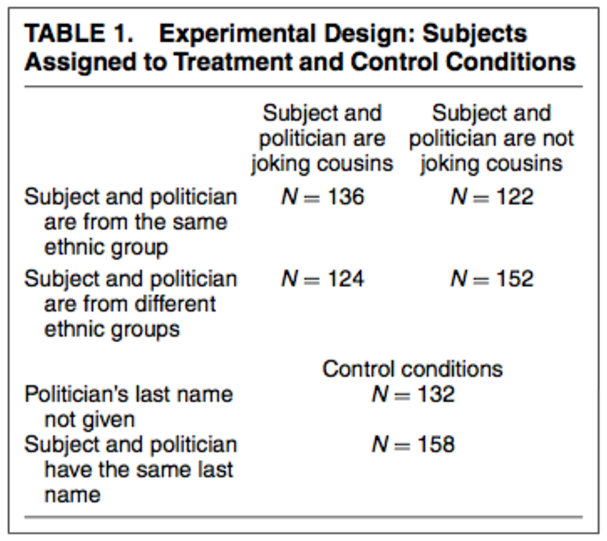
```

---
### Example: Cross-Cutting Cleavages in Mali


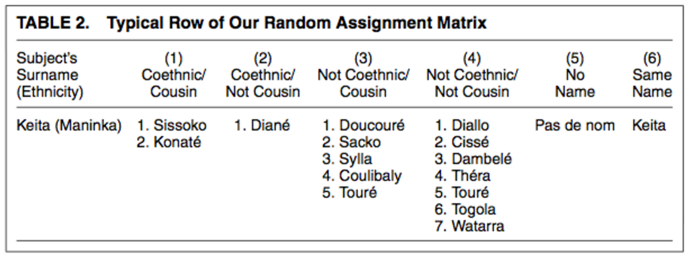


---
### Example: Cross-Cutting Cleavages in Mali


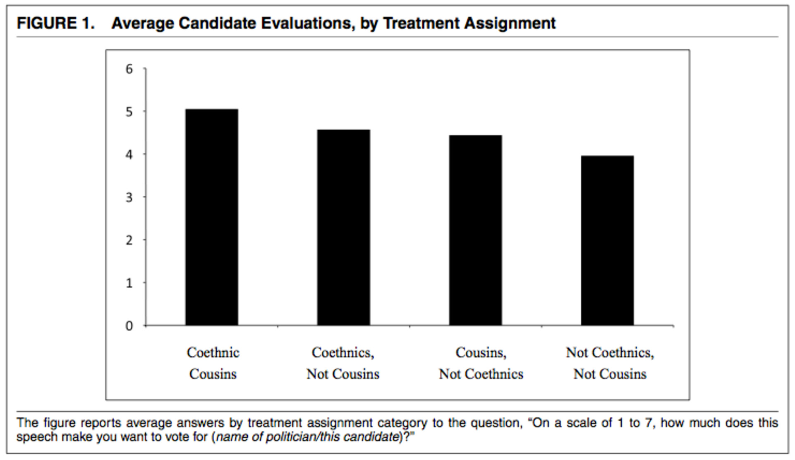


---
### Example: Cross-Cutting Cleavages in Mali


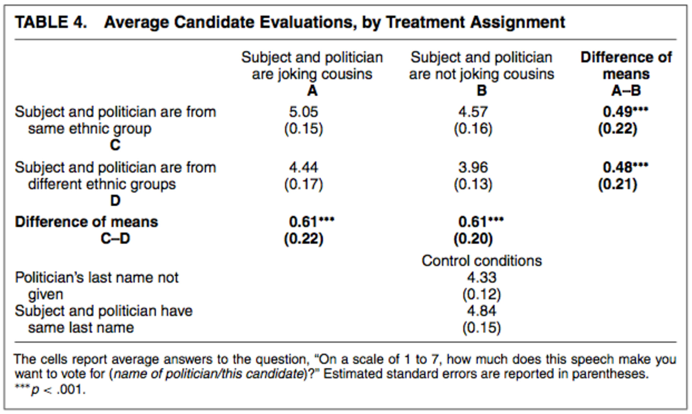


---
### Example: Cross-Cutting Cleavages in Mali

```{r, echo = FALSE, out.width="70%", fig.retina = 1, fig.align='center'}
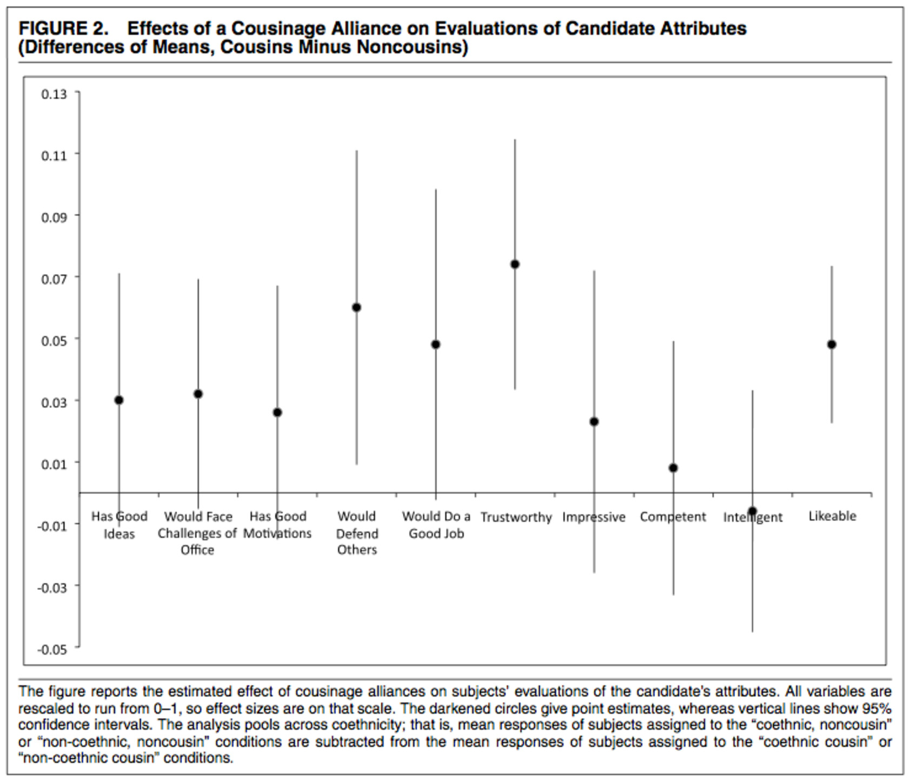
```


---
### Issues for Experiments

-   Compliance rates

-   Power

-   Appropriate significance tests


---
### Issues for Experiments

-   Meaning of the treatment

-   Measurement of the outcome

-   Networks

-   Exhaustiveness

-   Moderation


---
### Experimental Realism

> Experimental realism refers to impact in its most important sense: Do
> subjects believe the situation, problem, or issue they confront? Does
> it engage and interest them? Does it capture their attention?
> (McDermott 2002: 333)


---
### Psychological Realism


---
### Anti-Americanism and Female Representation in Jordan

Bush and Jamal:

> A pillar of American foreign policy in the Middle East since September
> 11, 2001, has been promoting democracy, with particular emphasis on
> support for women's representation. Given high levels of
> anti-Americanism in the region, does foreign pressure for policy
> reform undermine this project?


---
### Anti-Americanism and Female Representation in Jordan

Survey experiment using a random sample of adult Jordanians.


---
### Anti-Americanism and Female Representation in Jordan

> Interviewers read this script to respondents in the control group: In
> 2003, the electoral law in Jordan was revised to include a six-seat
> minimum quota for women in the national parliament. The new electoral
> law, which was announced in May 2010, raised the quota to 12 seats
> that are reserved for women.


---
### Anti-Americanism and Female Representation in Jordan

Treatment 1 adds:

> Many US government-funded organizations in Jordan, including the
> National Democratic Institute, have strongly supported women's
> political participation and the women who were elected via the quota
> in the past.


---
### Anti-Americanism and Female Representation in Jordan

Treatment 2 adds:

> Many imams and other religious leaders in Jordan have strongly
> supported women's political participation and the women who were
> elected via the quota in the past.


---
### Anti-Americanism and Female Representation in Jordan


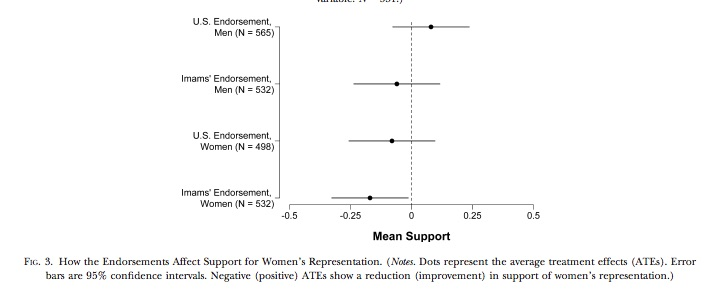


---
### Measurement of the Outcome

-   Subjective meaning of the outcome

-   Differential item functioning


---

```{r, echo = FALSE, out.width="70%", fig.retina = 1, fig.align='center'}
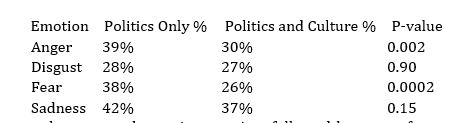
```


---

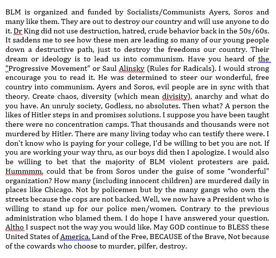


---

```{r, echo = FALSE, out.width="80%", fig.retina = 1, fig.align='center'}
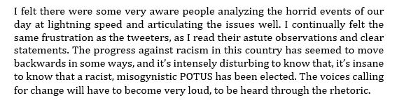
```


---
### SUTVA


---
### Electoral Fraud in Russia

Enikolopov et al. 2013:

> Using a randomized assignment of independent observers coordinated by
> Citizen Observer, a nongovernmental organization, we estimated the
> extent of electoral fraud in the city of Moscow during the Russian
> parliamentary elections held on December 4, 2011.


---
### Electoral Fraud in Russia

```{r, echo = FALSE, out.width="70%", fig.retina = 1, fig.align='center'}
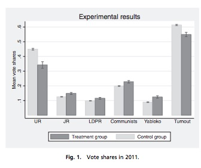
```

---
### Electoral Fraud in Russia

> The above results are likely to provide a lower bound on the extent of
> the electoral fraud, because the presence of observers at the polling
> stations did not fully prevent fraud. There are two additional
> assumptions that are required to ensure that these estimates are
> indeed the lower bound.


---
### Electoral Fraud in Russia

> First, observers themselves should not be involved in pro-opposition
> electoral fraud.


---
### Electoral Fraud in Russia

> Second, the presence of independent observers at a polling station
> should not affect the extent of fraud at the polling stations where
> observers were not present, so that the stable unit treatment-value
> assumption is satisfied.


---
### Electoral Fraud in Russia


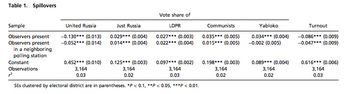


---
### Electoral Fraud in Russia

156 of 3,164 polling stations were in the treatment group.


---
### Exhaustiveness

IV Natural Experiments and Encouragement Designs


---
### Exhaustiveness and Emotion Treatments


---
### Trace Causal Process

Causal processes are hard for experiments

> Even when causal relationships are firmly established, demonstrating
> the mediating pathways is far more difficult -- practically and
> conceptually -- than is usually supposed. (Green, Ha, and Bullock
> 2010)


---
### Trace Causal Process

Design:

-   Carry out the experiment

-   Use in-depth interviews, focus groups, or documents to reconstruct
    decision-making or other processes during the experiment


---
### Trace Causal Process

> Experimental ethnography is a tool for answering questions about why
> programmatic attempts to solve human problems produce what effects, on
> average, in the context of the strong internal validity of
> large-sample, randomized, controlled field experiments. . . . This
> strategy can achieve experiments that create both a strong "black box"
> test of cause and effect and a rich distillation of how those effects
> happened inside that black box, person by person, case by case, and
> story by story. (Sherman and Strang, 2004: 205)


---
### Process Tracing in Experiments

[MouseLab](https://www.mouselabweb.org/demopage.html)

Open-ended questions


---
### Experiments and Case Selection


---
### Hands-On

On [this webpage](https://jnseawright.github.io/practice-of-multimethod/Chapter-6.html#How_often_do_test_the_assumptions_in_their_experiments), find a small group and work through the exercise *How Often Do Researchers Test the Assumptions in their Experiments?*


---
### Changes in Ethnic Identity in South America


---
###Venezuela

| Year | White | Mestizo | Moreno | Black | Other |
| :--: |:-----:|:-------:|:------:|:-----:|:-----:| 
| 2000 | 36%   | 43%     | 17%    | 4%    | 0%    | 
| 2004 | 25%   | 30%     | 36%    | 5%    | 4%    |
| 2008 | 37%   | 12%     | 41%    | 4%    | 6%    |

 Venezuelan Racial and Ethnic Self-Descriptions, 2000-2008


---
###Bolivia

| Year | White | Mestizo | Indigenous | Other |
| :--: |:-----:|:-------:|:----------:|:-----:| 
| 2004 | 18%   | 62%     | 16%        | 4%    | 
| 2006 | 11%   | 63%     | 20%        | 6%    |
| 2008 | 8%    | 68%     | 17%        | 7%    |

Bolivian Racial and Ethnic Self-Descriptions, 2004-2008


---
###Colombia

| Year | White | Mestizo | Indigenous | Black | Other |
| :--: |:-----:|:-------:|:----------:|:-----:|:-----:| 
| 2004 | 33%   | 51%     | 6%         | 9%    | 1%    | 
| 2006 | 35%   | 52%     | 4%         | 7%    | 2%    |
| 2008 | 35%   | 46%     | 4%         | 8%    | 7%    |

Colombian Racial and Ethnic Self-Descriptions, 2004-2008


---
###Peru

| Year | White | Mestizo | Indigenous | Black | Other |
| :--: |:-----:|:-------:|:----------:|:-----:|:-----:| 
| 2006 | 12%   | 75%     | 6%         | 1%    | 6%    | 
| 2008 | 12%   | 73%     | 7%         | 2%    | 6%    |
| 2010 | 12%   | 77%     | 3%         | 2%    | 6%    |

Peruvian Racial and Ethnic Self-Descriptions, 2006-2010


## 

---
### Populism and Ethnicity

Evo Morales's Indigenist Populism


---
### Chávez and 'América Morena'

-   Speech, Banco Central de Venezuela, August 18, 2000. 382.

-   Speech, Círculo Militar, Caracas, July 10, 2001. 231.

-   Speech, Teatro Teresa Carreño, Caracas, November 13, 2001. 596.

-   Speech, Avenida Universidad, Caracas, August 24, 2002. 402.

-   Speech, Avenida Bolívar, Caracas, April 13, 2003. 277.

-   Speech to the 7th summit of the African Union, July 1, 2006. 373.

-   Armed Forces Academy Graduation Speech, December 28, 2006. 717.


---

Could a populist political ideology built around the centrality of
non-European identity help explain the shifts in ethnic identity in
Venezuela and Peru?


---
### Experimental Design

Select a country context with relatively lower recent levels of populist
discourse and with no major recent transformations in ethnic identity.


---
### Experimental Design

Establish which currently marginalized groups are core to the national
identity.


---
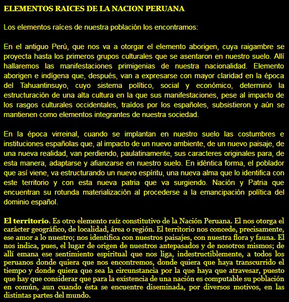


---
1.  The ancient, indigenous/aboriginal Peru

2.  The Viceroyalty of Peru

3.  Territory of Peru


---
A populist political message should tend to decrease social distance
vis-a-vis indigenous people, but not other groups such as Afro-Peruvians
or women in professions.


---
### Treatments

There is so much inequality in Peru because some powerful people who
supposedly know best conspire with the government and transnational
companies to steal the country's wealth for themselves. All of us who
are part of the real Peruvian people are victims of these so-called
leaders of the country. They steal from all of us and dictate the laws
to hurt anyone who isn't rich, from Lima, and white like they are.


---
### Treatments

There is so much inequality in Peru because we're still in the
intermediate steps of economic development. We need time, patience,
investment, and solid economic policy to ensure that our country will
keep growing. As our economy becomes bigger and more powerful, it wil
create more jobs in our country. Each Peruvian who is willing to work
hard and get an education will be able to achieve a good life, and
inequality will reduce.


---
### Treatments

There is so much inequality in Peru because our government has not done
enough to support social and economic solidarity in our country. All of
us Peruvians are one people, and we should support each other so that
everyone can enjoy the well-being we've earned. We can achieve this if
all those who are already well off pay their taxes and if we use that
money to improve our schools, hospitals, and neighborhoods, and to make
sure that they are as good as they can and should be.


---
### Social Distance Measures

<figure>
<p>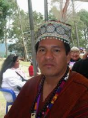</p>
</figure>


## 

---
### Bivariate ITT Results


| Social Distance From\... | Effect Estimate | $p$ value | 
|:------------------------:|:---------------:|:---------:|
| Indigenous Man           | 1.78            | 0.081     |  
| Afroperuvian Man         | 0.26            | 0.79      | 
| Professional Woman       | 0.50            | 0.59      | 


Sample includes 300 Peruvians selected randomly from among those walking
in a collection of parks throughout the city on several evenings during
September and October of 2017.


---
### Causal Forests Technique

-   Synthetic random forests

-   Out-of-bag estimation

-   Separate forests for each potential outcome

(Lu, Sadiq, Feaster, and Ishwaran 2017)


---
### Causal Forests Results


| Estimator      | Effect Estimate | $p$ value | 
|:--------------:|:---------------:|:---------:|
| Bivariate      | 1.78            | 0.081     |  
| Causal Forests | 2.11            | 0.034     | 


